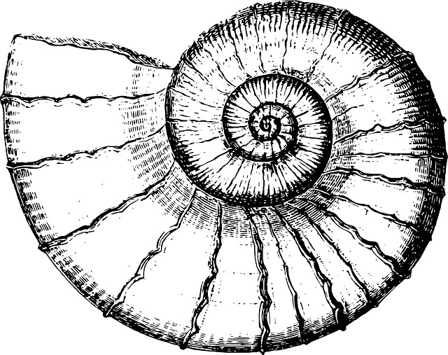

# Curso de Shell Script Gratuito do Iniciante ao Avançado

  

Imagem de [Emmie_Norfolk](https://pixabay.com/pt/users/Emmie_Norfolk-1034641/?utm_source=link-attribution&amp;utm_medium=referral&amp;utm_campaign=image&amp;utm_content=2145656) por [Pixabay](https://pixabay.com/pt/?utm_source=link-attribution&amp;utm_medium=referral&amp;utm_campaign=image&amp;utm_content=2145656)

Os códigos deste repositório é referente ao curso que encontrei no youtube no canal [Terminal Root](https://www.youtube.com/channel/UCqd9oVuR4tuKD5Y9AFwxz7Q).

Playlist: Curso de Shell Script. Disponível em: [https://www.youtube.com/playlist?list=PLUJBQEDDLNckrZvbkQetEwbEwEFN9KHqq](https://www.youtube.com/playlist?list=PLUJBQEDDLNckrZvbkQetEwbEwEFN9KHqq).